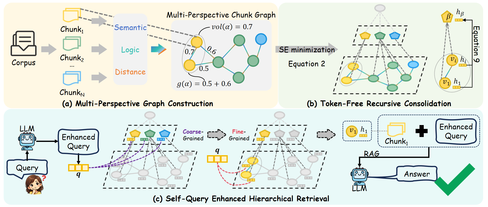

# Token-Free Hierarchical Indexing for RAG beyond LLM-based Summarization

> SeRAG introduces a token-free hierarchical indexing framework for Retrieval-Augmented Generation that eliminates the need for expensive LLM-based summarization.


## 🚀 **Highlights**
- ✅ **Token-Free Knowledge Abstraction**: Eliminates the heavy reliance on LLM-based summarization by introducing a recursive vector consolidation mechanism, reducing indexing costs and latency by orders of magnitude.
- ✅ **Information-Theoretic Indexing**: Replaces heuristic clustering with principled Structural Entropy Minimization, ensuring a topologically-faithful hierarchical taxonomy that preserves intrinsic knowledge communities. 
- ✅ **Multi-Perspective Graph Topology**: Synthesizes latent semantics, explicit logical multi-hop anchors, and narrative continuity into a unified graph, enabling the capture of complex, disparate evidentiary chains.
- ✅ **Coarse-to-Fine Hierarchical Retrieval**: Introduces a hybrid scoring framework that utilizes community abstractions as structural priors, effectively bridging the gap between underspecified queries and granular facts. 
  
<p align="center">
  
</p>


## 🛠️ **Usage**

### 1️⃣ Install Dependencies  

**Step 1: Install Python packages**

```bash
pip install -r requirements.txt
```

**Step 2: Download Spacy language model**

```bash
python -m spacy download en_core_web_trf
```

**Step 3: Set up your OpenAI API key**

```bash
export OPENAI_API_KEY="your-api-key-here"
export OPENAI_BASE_URL="your-base-url-here"
```

**Step 4: Prepare Embedding Model**

Make sure the embedding model is available at:

```
model/all-mpnet-base-v2/
```

**Step 5: Set up Configuration files** 

```
SeRAG/src/config.py
```


### 2️⃣ Quick Start Example

```bash
SPACY_MODEL="en_core_web_trf"
EMBEDDING_MODEL="model/all-mpnet-base-v2"
DATASET_NAME="2wikimultihop"
LLM_MODEL="gpt-4o-mini"
MAX_WORKERS=16

python run.py \
    --spacy_model ${SPACY_MODEL} \
    --embedding_model ${EMBEDDING_MODEL} \
    --dataset_name ${DATASET_NAME} \
    --llm_model ${LLM_MODEL} \
    --max_workers ${MAX_WORKERS} 

```
